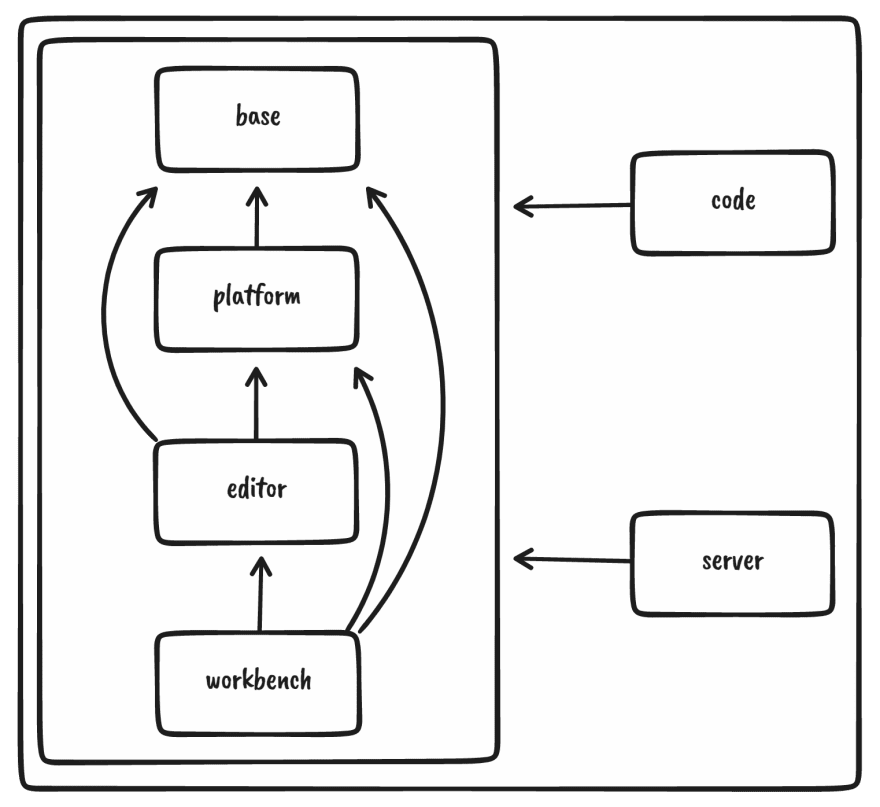

_You can find a [video version](https://youtu.be/NEzYE1-37SA) of this article on my [YouTube channel](https://www.youtube.com/channel/UC-KqnO3ez7vF-kyIQ_22rdA)._

---

Did **you** know that you can have a **huge** impact in contributing to Open Source, even **without** coding new features or fixing bugs?

Let’s get rid of the misconception of Open Source being only writing code, because there are **many** other activities that are a lot **beneficial,** and you should do them regularly!

Hi, I’m Leonardo and in this article I’m going to move the spotlight to give some more visibility to those core activities that make Open Source projects successful, without writing a single line of code.

I’m going to split the activities into 6 categories and provide real examples for each of them:

- [Documentation](#documentation)
- [Management](#management)
- [Awareness](#awareness)
- [Design](#design)
- [Code-related](#code-related)
- [Not only software](#not-only-software)

## Documentation

The name is pretty much self-explanatory, but this is really often overlooked. Let’s say you want to contribute to a project, but you have no idea how to run it on your machine. You hope that there’s a `CONTRIBUTING.md` file in the repo that tells you how to do that. Without that piece of documentation, you wouldn’t even be able to run the project! Do you get how important documentation is?

If you spot a project with outdated or even missing documentation, for example about setting up the software or describing the architecture, the UI… well, here’s a huge gap to fill. Writing some docs will give a huge boost to everyone else trying to contribute.

And there’s even more!

You can for example write blog posts or youtube videos with tutorials, examples, and demos to even further generate content helping the community and the other contributors.

Don’t forget that answering questions on StackOverflow can be considered documentation too! Imagine someone googling for a problem and finding the answer on StackOverflow. You helped not only those who asked the question but everyone else finds your answer later. This counts as well!

Oh, right, you can also translate existing content into your language to spread the knowledge, why not?

## Management

Open Source projects have some kind of project management as well, usually on the shoulders of the owners and maintainers, but if you’re an organized person, you can help them a lot!

The main platform, in this case, is the GitHub issues tab. It’s quite common on large projects that dozen of issues spawn every day and they need some kind of validation and cleanup, that is a highly time-consuming activity.

You can help the community for example by linking duplicate issues, asking for more details in case a bug or a feature request is not clear enough, reproducing bugs and adding yourself more context, and so on.

## Awareness

If you have deep knowledge of a particular project and you like public speaking, you might consider organizing workshops, meetups or talks to raise awareness about specific software or project.

Don’t forget that the more visibility a project gets, the more users and contributors might arise.

Do you know an easy way to raise awareness about open source? Hit like on this video and subscribe to my channel. I post regularly videos about Open Source and by helping me, you’re also helping the Open Source community! Thank you!

## Design

This can be intended as a visual medium of documentation. Complex structures or flows often require a good visualization to be explained and understood properly. You can consider creating structured UML or simple flow chart diagrams to visualize and simplify.

You can see some examples from the [vscode repo](https://github.com/microsoft/vscode/wiki/Source-Code-Organization), where they show in a simple diagram their core architecture or how they manage the multi-target environment.

## Code related

Let’s talk about code that is not features or bugfixes.

Code reviews are always welcome, you can have a look at open pull requests and add comments. Don’t forget to be polite and respectful when reviewing other developers’ code, but constructive feedback is always well perceived, they’ll be grateful.

If you really really want to write code, you can think of creating some internal tools, for example, to quickly set up the project, improve the test coverage, and make debugging and local development easier. In general, code which helps the other contributors to be more productive and safe.

## Not only software

If you think that GitHub is only a place where people put code, you’ll be surprised!

There are many repositories that focus on collecting information and resources for their communities, not only for developers!

You can find many of them from Explore -> Topics -> [Awesome lists](https://github.com/topics/awesome).

As you can read, there are lists for a plethora of different topics and there’s a list of lists serving as an index, organized in categories.

There are repos about books, gaming, business, networking… all kind of stuff!

Contributing to those lists is still counting as Open Source!

---

With this last one, we covered all categories. As you can see, there are so many ways to contribute to Open Source, did you know all of them? If you want to add something, just write a comment!
