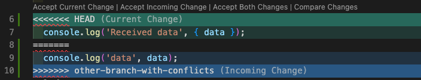
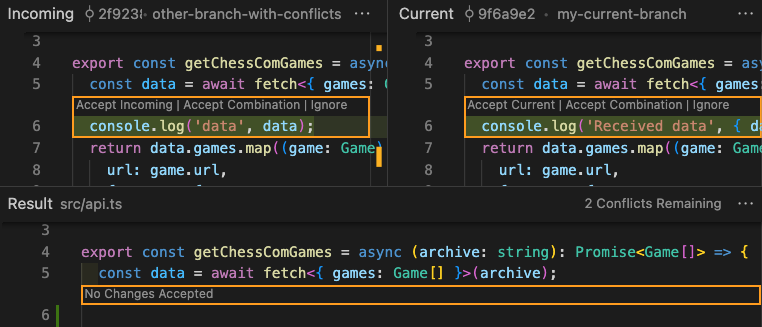

Merge conflicts can be scary, but if you know how to use your tools, there's no need to worry!
_(Unless you're merging two branches 3 months old and there are 57 files with multiple conflicts. In that case, panic is understandable!)_

Visual Studio Code recently introduced the [three-way merge editor](https://code.visualstudio.com/updates/v1_69#_3-way-merge-editor).

This was supposed to replace the old inline editor.

However, as soon as the new editor has been set as default, the community loudly asked to get their old UI back. Have a look at [Issue#160806](https://github.com/microsoft/vscode/issues/160806)

You can toggle which one you want to use from the `git.mergeEditor` setting.

To be honest, I really like the inline experience of handling merge conflicts that VSCode (and many other tools!) offers.

It makes everything easier as you don't need to worry about the UI, all you have to think about is the code that is conflicting.

I tested the three way editor and it's not bad, but it adds a layer that sometimes is unnecessary. Again, personal opinion here.

---

But what's the point in handling conflicts directly in your IDE?
The main advantage is that you already have all the tools you need, and while resolving the conflicts you can for example format the code and recompile without having to swap window.

Since I use VSCode as my primary IDE (actually, it's a text editor), I recorded a video showing the main features it offers to help you.

I also showcase both inline (old) and three-way (new) editors, so you can decide which one you like the most!



---

**What do you use to resolve merge conflicts? If the answer is Visual Studio Code, which one of the two UIs do you use, three way or inline?**
